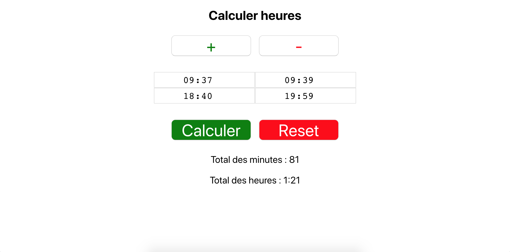

# About the tool

The tool can calculate the time between two different hours. You can increase/decrease the number of field by clicking the "+" and "-" button.

## Preview

## Technology used

React

## Author

Matis Karamenderes
